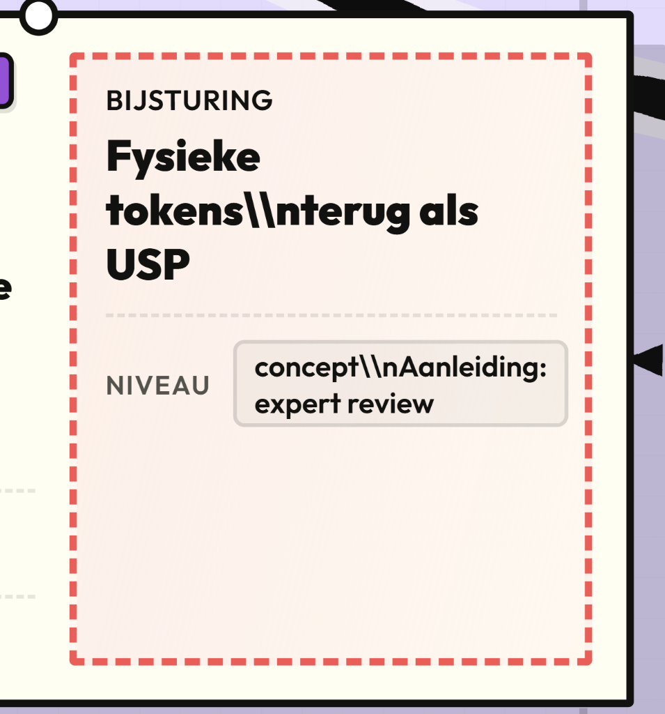

CONCEPT
POST IT 1
preview:

Titel:
Conceptkader scherpstellen
Doel:
De Hill vertalen naar een concreet conceptdoel voor mentale beweging.
Perspectief:
User
Fase:
Reflect
Hill:
Alle Hills — basis voor samenwerking
Principe:
Focus on User Outcomes
Kernresultaat:
Alle conceptalternatieven kregen hetzelfde doel: structuurgerichte gebruikers helpen om vaste denkpatronen te doorbreken.

Uitklapcontent:

Waarom casusspecifiek:
De Strategy-fase had duidelijk gemaakt dat MOBUS draait om mentale mobiliteit. In Concept moest ik voorkomen dat ik te snel losse ideeën of features ging bedenken. Daarom stelde ik eerst een kader op: elk concept moest aantonen hoe MOBUS gebruikers intuïtief uit routine haalt en nieuwe perspectieven laat genereren.
Hoe uitgevoerd:
Ik vertaalde de Hill naar een conceptingdoel. Daarbij bleef het einddoel hetzelfde, maar mochten key insight, context en relevante theorie per conceptalternatief verschillen.
Conceptingdoel:
Het mentaal in beweging brengen van structuurgerichte studenten en professionals, zodat zij vaste denkpatronen doorbreken en tot creatieve innovatie en nieuwe perspectieven komen.
Key insight:
Structuurgerichte professionals willen wel nieuwe perspectieven ontwikkelen, maar ervaren een mentale blokkade door angst voor sociale afwijzing wanneer ze plotseling speels of afwijkend moeten doen.
Output:
Conceptkader, Hill-koppeling, key insight en uitgangspunt voor verbredende conceptstudie.
Consequentie voor proces:
Dit kader voorkwam dat de Concept-fase een losse brainstorm werd. Elk alternatief moest te herleiden zijn naar mentale beweging, sociale veiligheid en het doorbreken van routine.

POST IT 2
Preview:

Titel:
Verbredende conceptstudie
Doel:
Meerdere MOBUS-richtingen genereren zonder direct één oplossing vast te zetten.
Perspectief:
UX/UI + User
Hill:
Uit vaste denkpatronen komen
Principe:
Restless Reinvention
Kernresultaat:
Concepten werden bewust breed verkend via extremen, sabotage en metaforen.

Uitklapcontent:

Waarom casusspecifiek:
MOBUS moet vaste denkpatronen doorbreken. Daarom moest ook mijn conceptproces zelf niet te veilig of voorspelbaar worden. Ik gebruikte divergerende vragen om de grenzen van de concepten op te rekken.
Hoe uitgevoerd:
Ik gebruikte divergent modifiers om conceptalternatieven te verbreden:
- Wat als de ruimte de blueprint saboteert?
- Wat als de ruimte actief tegenwerkt zodra mensen in routine vervallen?
- Wat als Seductive Interaction tot het uiterste wordt gepusht?
- Wat als er geen natuurlijk licht naar binnen valt?
- Wat als de MOBUS voor één persoon een cocon wordt die autonoom om je heen vormt?

Output:
Brede set conceptalternatieven, conceptposters en eerste experience directions.
Resultaat:
De conceptstudie leverde richtingen op zoals speelse blokkade, cognitive coupe, controlled chaos, activation through environment, perspective shift, de mentale schakelaar, de springveer, spijolen maar dan anders en de mo-bubbel-bus.
Consequentie voor proces:
De divergentie maakte zichtbaar welke concepten vooral inspirerend waren en welke concepten ook logisch, toetsbaar en prototypbaar konden worden.

Titel:
Design Panel met SQUACK
Doel:
Conceptposters toetsen op begrijpelijkheid, structuur en ontwerplogica.
Perspectief:
UX/UI
Hill:
Uit vaste denkpatronen komen
Principe:
Diverse Empowered Teams
Kernresultaat:
Peers hielpen om concepten scherper te maken voordat externe stakeholders ze zagen.

Uitklapcontent:

Waarom casusspecifiek:
De concepten waren gebaseerd op mentale beweging, metaforen en theorie. Daardoor bestond het risico dat ze voor buitenstaanders te abstract of moeilijk te volgen waren. Voor ik ze aan externe stakeholders presenteerde, wilde ik eerst toetsen of ontwerpers de conceptlogica konden begrijpen.
Hoe uitgevoerd:
Ik organiseerde een Design Panel waarin peers via de SQUACK-methode feedback gaven op mijn conceptposters. Door mijn projectcontextposter erbij te leggen, gaf ik hen eerst de juiste problem space mee. Daardoor konden ze de concepten gerichter beoordelen.
Met wie:
Medestudenten Product Design/CMD met ervaring vanuit onder andere Jumbo en Erfgoed Gelderland.
Passende expertise:
Belanghebbenden die met een kritische ontwerpersbril kijken naar bruikbaarheid, communicatie en ontwerplogica van een concept.
Output:
Feedback op conceptposters, verbeterpunten voor communicatie, structuur en conceptuitleg.
Resultaat:
De feedback hielp om te zien welke concepten begrijpelijk waren, welke toelichting nodig hadden en welke richtingen sterker of zwakker overkwamen.
Consequentie voor proces:
De concepten werden aangescherpt voordat ik ze aan bredere stakeholders voorlegde. Hierdoor werd de volgende playback gerichter en minder afhankelijk van mijn eigen uitleg.

POST IT 4

Titel:
Conceptposters maken
Doel:
Abstracte conceptrichtingen tastbaar maken voor feedback.
Perspectief:
UX/UI + User
Hill:
Uit vaste denkpatronen komen
Principe:
Restless Reinvention
Kernresultaat:
Losse ideeën werden bespreekbare conceptalternatieven.

Uitklapcontent:

Waarom casusspecifiek:
MOBUS is een ruimtelijke en ervaringsgerichte case. Alleen tekst of losse ideeën waren niet genoeg om feedback op te halen. De concepten moesten zichtbaar en bespreekbaar worden.
Hoe uitgevoerd:
Ik werkte verschillende conceptrichtingen uit als conceptposters. Per alternatief kon de context, key insight en relevante theorie verschillen, terwijl het overkoepelende doel gelijk bleef: mentale beweging activeren.
Voorbeelden van conceptrichtingen:
- Speelse blokkade
- Bouw eerst, praat later
- Cognitive coupe
- Controlled chaos
- Activation through environment
- Perspective shift
- De mentale schakelaar
- De springveer
- Sjoelen maar dan anders
- Mo-bubbel-bus
Output:
Conceptposters, conceptnamen, conceptuitleg en eerste visuele richtingen.

Consequentie voor proces:
De posters maakten het mogelijk om niet alleen over ideeën te praten, maar concepten actief te vergelijken, bevragen en filteren.

POST IT 5

Titel:
Playback met conceptposters
Doel:
Concepten filteren richting een haalbare keuze voor fysiek prototypen.
Perspectief:
Business + Technology + User
Hill:
Ruimte die meebeweegt
Principe:
Focus on User Outcomes + Restless Reinvention
Bijsturing:
Van abstracte conceptset naar twee concrete richtingen.

Datum:
13 april 2026
Met wie:
Toin Peters, Ruben Wiltink, Iwan van Bochove, Tugba Gökdemir Ozdes, medestudenten Automotive & Embedded Systems en betrokken technische studenten.
Waarom casusspecifiek:
Waar eerdere sessies vooral gingen over dromen, gebruikerswaarde en gewenste ervaring, had ik hier de praktische realiteit nodig. MOBUS moet uiteindelijk fysiek geprototypeerd kunnen worden. Daarom waren perspectieven vanuit projectmanagement, technologie, duurzaam materiaalgebruik, prototyping en digital storytelling belangrijk.
Hoe uitgevoerd:
Eerst lichtte ik de concepten kort toe. Daarna werden op post-its opmerkingen geschreven en vragen gesteld. Vervolgens ging ik gericht in gesprek met de deelnemers over de concepten.
Resultaat:
De sessie maakte duidelijk dat de concepten inhoudelijk en technisch nog te abstract waren. Ook merkte ik dat ik te veel presenteerde en dat feedback via post-its niet voor iedereen goed werkte.
Belangrijkste feedback:
- Activatie via prikkels werkt, maar moet goed gedoseerd worden.
- Er zijn sterke concepten, maar niet alles is even concreet of uitvoerbaar.
- MOBUS moet niet te veel ideeën tegelijk dragen.
- Maak het technisch en praktisch beter voorstelbaar.
- Denk scherper na over wat er fysiek gebouwd of getest kan worden.
- Post-its zijn niet voor iedereen de beste manier om feedback te geven.
Before:
Een brede set conceptposters met veel verschillende richtingen.
After:
Terugbrengen naar twee concrete concepten en doorpakken naar een gerichte 1-op-1 met de projectmanager.
Consequentie voor proces:
De Concept-fase verschoof van breed verkennen naar gericht selecteren. Dit was nodig om de stap naar fysiek prototypen in Structure mogelijk te maken.
Mijn eigen bijsturing:
Ik besloot de concepten niet verder als brede posterreeks te blijven presenteren, maar terug te brengen naar minder richtingen die technisch, inhoudelijk en ruimtelijk beter toetsbaar zijn.

CONCEPT STATUS
Periode:
23 maart → 13 april 2026
Status:
Voltooid

De Concept-fase eindigde met de keuze voor De Denk-Doe Bus. Dit concept sluit beter aan op de kern van MOBUS: gebruikers fysiek en mentaal in beweging brengen door fysieke input, digitale verwerking en subtiele ondersteuning vanuit de bus. De Ademendr Wagon bleef interessant, maar viel af omdat het te individueel was en te weinig samenwerking ondersteunde.
